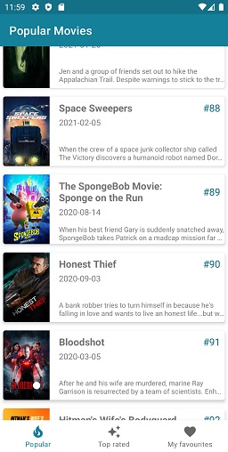
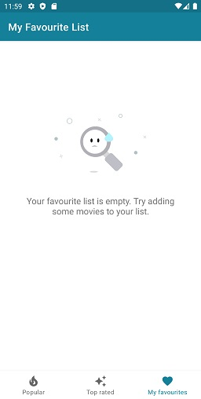
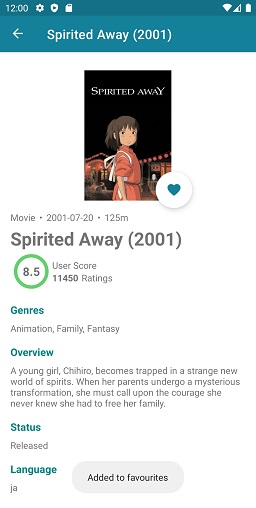
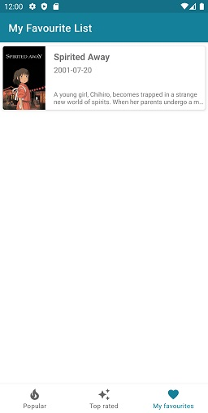

# Movies App with Clean Architecture & ProGuard enabled
In this repository you will find an Android project with:
- Jetpack Components
- TMDB API and room database implementation
- Proguard enabled
- Core modules and DynamicFeature
- SSH Pinning
- Database Encryption
- Unit testing for repository and viewmodels
- CircleCI config to run tests and build universal-release apk

# Screenshots 

# Dependencies used

- Navigation
- Dagger-Hilt
- Lifecycle 
- Coroutines
- LiveData, Flow
- Retrofit
- Room
- Paging
- SqlCipher
- Shimmer
- Lottie
- LeakCanary
- Mockito

